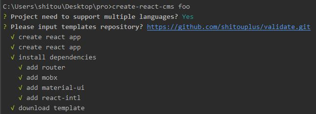

# create-react-cms  [](https://www.npmjs.com/package/create-react-cms) [](https://github.com/shitouplus/create-react-cms/blob/master/LICENSE) 
> Quickly create cms based on react

## Install

```
$ npm install create-react-cms -g
```

## Usage

```
create-react-cms <name> 
```

## Feature
> 1. auto install react-router, mobx, react-intl, material-ui
> 2. download templates of your repository

## Example

